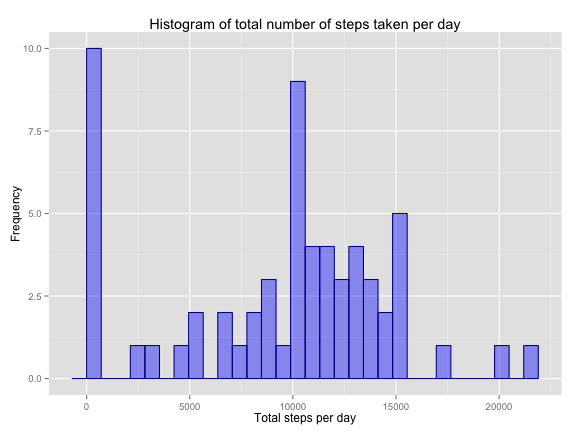
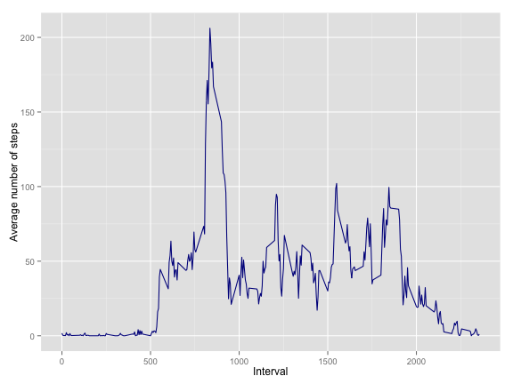
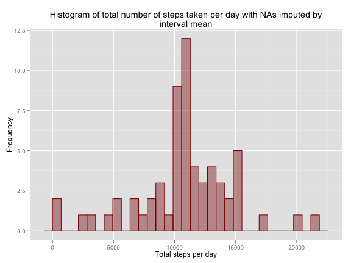
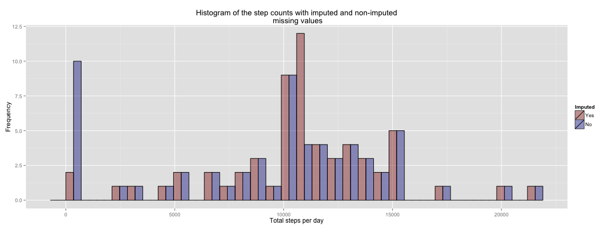
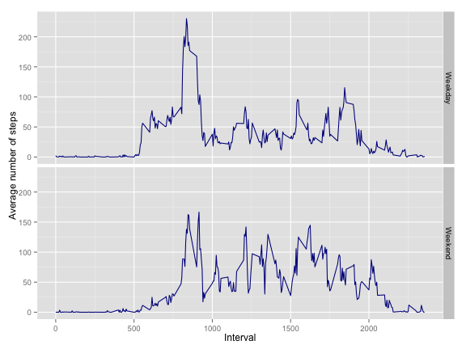

This report analyses the data set available [here](https://d396qusza40orc.cloudfront.net/repdata%2Fdata%2Factivity.zip), that contains information on a subject's activity measured in steps with a monitoring frequency of 5 minutes. The report is structured
per the assignment found in [README.html](README.html). 

## Loading and preprocessing the data

```r
step_data <- read.csv(unz("activity.zip", "activity.csv"), colClass = c("integer", "Date", "integer"))
```

## What is mean total number of steps taken per day?
The following histogram shows the total number of steps taken per day for our subject. 

```r
totals <- step_data %>% group_by(date) %>% summarise(total = sum(steps, na.rm = T))
ggplot(data=totals, aes(totals$total)) + 
  geom_histogram(col="darkblue", fill="blue", alpha = .4) +
  ggtitle("Histogram of total number of steps taken per day") +
  xlab("Total steps per day") + ylab("Frequency")
```

 


```r
mean_steps <- round(mean(totals$total),2)
median_steps <- median(totals$total)
```
The mean of the total steps taken per day is 9354.23, while the median is 10395.

## What is the average daily activity pattern?

```r
mean_interval <- step_data %>% group_by(interval) %>% summarise(mean_steps = mean(steps, na.rm = T))
ggplot(mean_interval, aes(interval, mean_steps)) + geom_line(col = "darkblue") + 
  xlab("Interval") + ylab("Average number of steps")
```

 

```r
max_val <- max(mean_interval$mean)
max_interval <- mean_interval[mean_interval$mean == max_val,"interval"]
```
The interval with ID 835 has the highest average number of steps (206.1698113) across all days.

## Imputing missing values

```r
na_index <- is.na(step_data$steps)
total_nas <- sum(na_index)
perc_nas <- round(mean(na_index) * 100,2)
```
The data set contains 2304 missing values, that is 13.11% of the values are missing. 

The following histogram shows the total number of steps taken per day for our subject, with the missing values replaced by the interval mean across all days. 

```r
# Add mean of interval with recycling
imputed_data <- step_data
imputed_data$mean_steps <- mean_interval$mean_steps

#Replace NA values with mean of interval
imputed_data[na_index,]$steps <- imputed_data[na_index,]$mean_steps
imputed_data <- select(imputed_data, -mean_steps)
```

```
## Error in select(imputed_data, -mean_steps): unused argument (-mean_steps)
```

```r
#Histogram
totals_imp <- imputed_data %>% group_by(date) %>% summarise(total = sum(steps))
ggplot(data=totals_imp, aes(totals_imp$total)) + 
  geom_histogram(col="darkred", fill="darkred", alpha = .4) +
  ggtitle("Histogram of total number of steps taken per day with NAs imputed by\ninterval mean") + 
  xlab("Total steps per day") + ylab("Frequency")
```

 

```r
mean_steps_imp <- round(mean(totals$total),2)
median_steps_imp <- median(totals$total)
```
With missing values replaced, the mean of the total steps taken per day is 9354.23, while the median is 10395. The difference with the non-imputed means is significant. Especially for the mean as more days have a count of zero when missing values for the amount of steps are not replaced by the interval mean. 

The following graph shows a combined plot of the two histograms to highlight the differences.

```r
cbPalette <- c("darkred", "darkblue")

combined_data <- rbind(data.frame(Imputed="Yes", obs=totals_imp$total),
                       data.frame(Imputed="No", obs=totals$total))

ggplot(combined_data, aes(x = combined_data$obs, fill = Imputed)) + scale_fill_manual(values=cbPalette) +
  geom_histogram(colour="black", position="dodge", alpha = .4) +
  ggtitle("Histogram of the step counts with imputed and non-imputed\n missing values") + 
  xlab("Total steps per day") + ylab("Frequency")
```

 
As expected, the frequency of zero count days is significantly reduced, while the frequency
of days with a step count around the average total number of days is increased with the same amount. 
This is a consequence of the fact that we replace the missing values with the average value of the step 
count in their given interval.

## Are there differences in activity patterns between weekdays and weekends?
The following plot shows the average amount of steps taken in a day per 5 minute interval, split out over weekdays and weekend days.

```r
library("timeDate")
mean_weekdays <- imputed_data %>% mutate(weekend = isWeekend(date))
mean_weekdays$weekend <- as.factor(mean_weekdays$weekend)
levels(mean_weekdays$weekend) <- c("Weekday", "Weekend")
mean_weekdays <- mean_weekdays %>% group_by(interval, weekend) %>% summarise(mean_steps = mean(steps))
ggplot(mean_weekdays, aes(interval, mean_steps)) + geom_line(col = "darkblue") + 
  xlab("Interval") + ylab("Average number of steps") + facet_grid(weekend~.) 
```

 

The activity profiles differ in a number of ways. In particular, the change in activity in the morning is less gradual during weekdays. At noon, a higher number of steps are recorded during weekdays. Finally, throughout the day there's also a higher overall level of activity in the weekend. 
